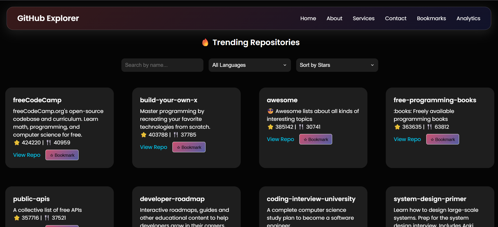

# 🚀 GitHub Project Explorer

A **modern, responsive, and feature-rich web app** to explore trending open-source repositories on GitHub, filter them by language, sort by stars or update time, bookmark favorites, and visualize repository analytics — all with a clean glassmorphism design!

---

## 🔮 Live Demo
👉 [Click here to see it live](https://git-x.vercel.app/) 

---

## 📸 Preview



---

## 🛠️ Features

✅ **Trending Repos Feed**  
✅ **Search by name**  
✅ **Language Filter** (e.g. JavaScript, Python, etc.)  
✅ **Sort Options** ( Stars ⭐ | Last Updated 🕒 | Forks 🍴)  
✅ **Responsive Layout** (Mobile + Desktop)  
✅ **Bookmark Favorites** with LocalStorage  
✅ **Analytics Charts** using Chart.js  
✅ **Attractive UI** with CSS Glassmorphism  
✅ **404 Page + Navbar + Footer + Routing**  
✅ **Loader while fetching GitHub API**

---

## 📁 Folder Structure

```bash
src/
├── components/
│   ├── RepoCard.jsx
│   ├── RepoCard.css
│   ├── navbar/
│   │   ├── Navbar.jsx
│   │   └── Navbar.css
│   ├── charts/
│   │   └──RepoCharts.jsx
│   └── Footer/
│       ├── Footer.jsx
│       └── Footer.css
├── pages/
│   ├── home/
│   │   ├── Home.jsx
│   │   └── Home.css
│   ├── about/
│   │   ├── About.jsx
│   │   └── About.css
│   ├── contact/
│   │   ├── Contact.jsx
│   │   └── Contact.css
│   ├── services/
│   │   ├── Services.jsx
│   │   └── Services.css
│   ├── analytics/
│   │   ├── Analytics.jsx
│   │   └── Analytics.css
│   └── Bookmarks.jsx
├── App.jsx
├── main.jsx
└── index.css
```
----
## Tech Stack
| Tech            | Description                        |
| --------------- | ---------------------------------- |
| ⚛️ React.js     | UI Library (Vite setup)            |
| 🎨 CSS          | Glassmorphism styling              |
| 📊 Chart.js     | Repository analytics visualization |
| 🌐 GitHub API   | Fetching trending repositories     |
| 💾 LocalStorage | Saving bookmarks across sessions   |
| 🔁 React Router | Multi-page navigation              |

----
## 📦 Installation
* **Clone the repository:**
```js
git clone https://github.com/your-username/github-project-explorer.git
cd github-project-explorer

```
* **Install dependencies:**

```js
npm install
```
* **Run the development server:**
```bash
npm run dev
```
---

## 🔐 GitHub API Rate Limit Notice

**GitHub’s free API has a limit of 60 requests/hour (unauthenticated).
If you see a 403 error, wait for a while or authenticate with a personal access token.**

## 📚 Roadmap
 - Trending Repo Cards

 - Search, Filter, Sort UI

 - Bookmark Feature with LocalStorage

 - Analytics Page

 - Responsive Navbar + Hamburger

 - 404 Page & Footer

 - Add Pagination (future)

 - User login + saved data via Firebase (future)

 ## 🙏 Acknowledgements
This project wouldn't be possible without these amazing resources and tools:

-  GitHub REST API — powering all repository data and insights

-  Chart.js — beautiful charts and data visualization

-  React Router DOM — smooth navigation across multiple pages

-  Vite — blazing fast React project setup and dev server

-  CSS Glassmorphism — stylish UI effect inspiration

-  React Icons — icons used across the UI

-  freeCodeCamp, Traversy Media, Codevolution — for excellent React & API tutorials

-  MDN Web Docs — reference for JavaScript, CSS, and web standards

-  GitHub Community — for support and inspiration

 ## 🧑‍💻 Author
Made with ❤️ by Rishabh

[LinkedIn](https://www.linkedin.com/in/rishabh-dtu27/) 

